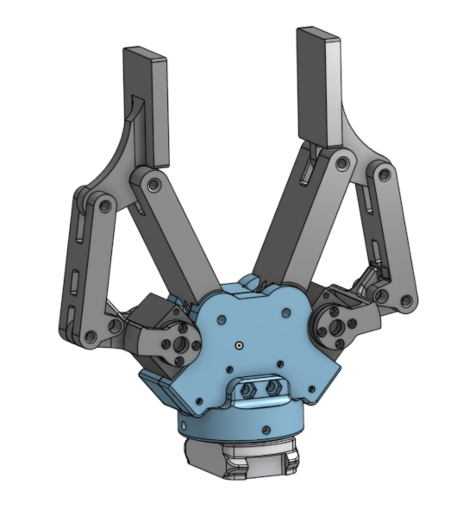
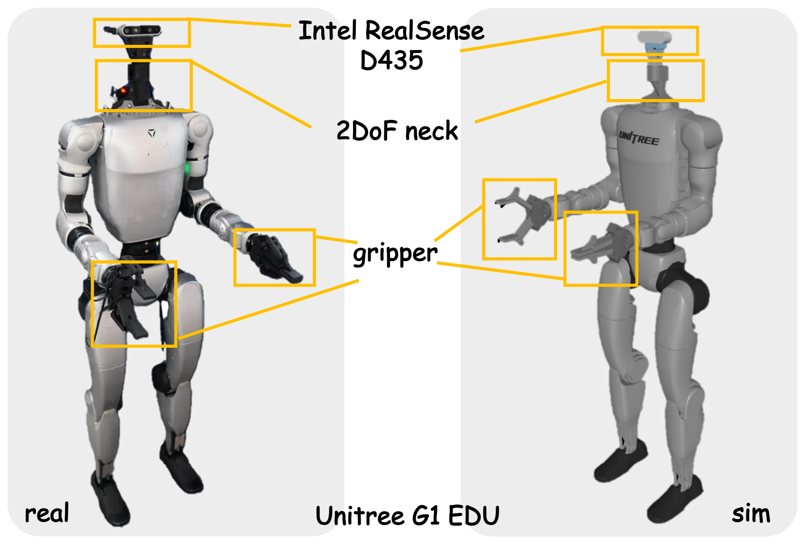
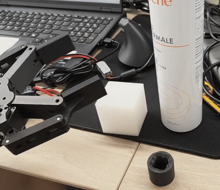

# open_adaptive_2finger_gripper

Open-source adaptive 2-finger gripper for **research use**, designed around **X330-size** servos (ROBOTIS DYNAMIXEL XL330 / XC330 compatible).  
Inspired by the 2F-85 class gripper concept.

## Visual Preview

<p>
  
  <span>&nbsp;</span>
  
</p>

## Real Demo Video



---

## Key Features

- Adaptive 2-finger grasping mechanism
- Servo compatibility: DYNAMIXEL **XL330 / XC330**
- CAD source provided as **STEP** files
- Designed to be **3D-printable** and easy to integrate
- Optional mounting adaptor: Unitree G1 flange

---

## CAD Models (STEP)

All part STEP files are located in:

- `assets/cad_models/`


---

## Bill of Materials (BOM)

> Quantities and a few dimensions are left as **TBD**. Fill these in once you confirm your final hardware set.

| Component | Spec | Qty | Notes                                                     |
|---|---|----:|-----------------------------------------------------------|
| Servo | DYNAMIXEL **XL330 / XC330** |   2 | Choose one model; same size                               |
| USB-to-Dynamixel | U2D2  |   1 | USB control                                               |
| Cylindrical dowel pin | **M3** |   8 | Length M3×16                                              |
| Brass bushing | **3×6×5** (ID×OD×L) copper/brass |   8 | Press-fit into printed parts                              |
| Torsion spring | **250°**, wire dia **>= 1.0 mm**, coil dia **6 mm**, leg length **20 mm** |   2 | Common spec; search keywords: "扭簧 250度 线径1mm 圈6mm 腿长20mm" |
| Screws | M2/M3 assorted | TBD | TBD                                                       |
| 3D printed parts | Printed from your CAD | TBD | Material & print settings below                           |

### 3D Printing Notes
- Recommended materials: **PLA+ / PETG / PLA-CF** (stiffer materials help reduce flex)
- Typical starting point: **4 perimeters**, **30% infill**
- For parts that host bushings/pins: prioritize **dimensional accuracy** and **layer adhesion**

---

## Used in DemoHLM

This gripper is used in the **DemoHLM** project:
- https://beingbeyond.github.io/DemoHLM/

If this gripper is useful for your research, please cite:

```bibtex
@article{demohlm,
  title={DemoHLM: From One Demonstration to Generalizable Humanoid Loco-Manipulation},
  author={Fu, Yuhui and Xie, Feiyang and Xu, Chaoyi and Xiong, Jing and Yuan, Haoqi and Lu, Zongqing},
  journal={arXiv preprint arXiv:2510.11258},
  year={2025}
}
```


### Control Notes (TBD)
...

---

## Safety & Disclaimer

- For **research / educational use only**
- This design is provided **AS IS**, without warranty.
- Building and operating robotic grippers can cause equipment damage or injury if used improperly.
- You are responsible for assembly, integration, testing, and operation.
- This project is **not affiliated with or endorsed by** any third party.

---

## License

**Non-commercial only**: Creative Commons Attribution–NonCommercial 4.0 International (**CC BY-NC 4.0**).  
See `LICENSE`.

---

## Contributing

Contributions are welcome (issues/PRs):

---

## Contact

Chaoyi Xu  
Email: chaoyi0027@gmail.com  
Website: co1one.github.io
